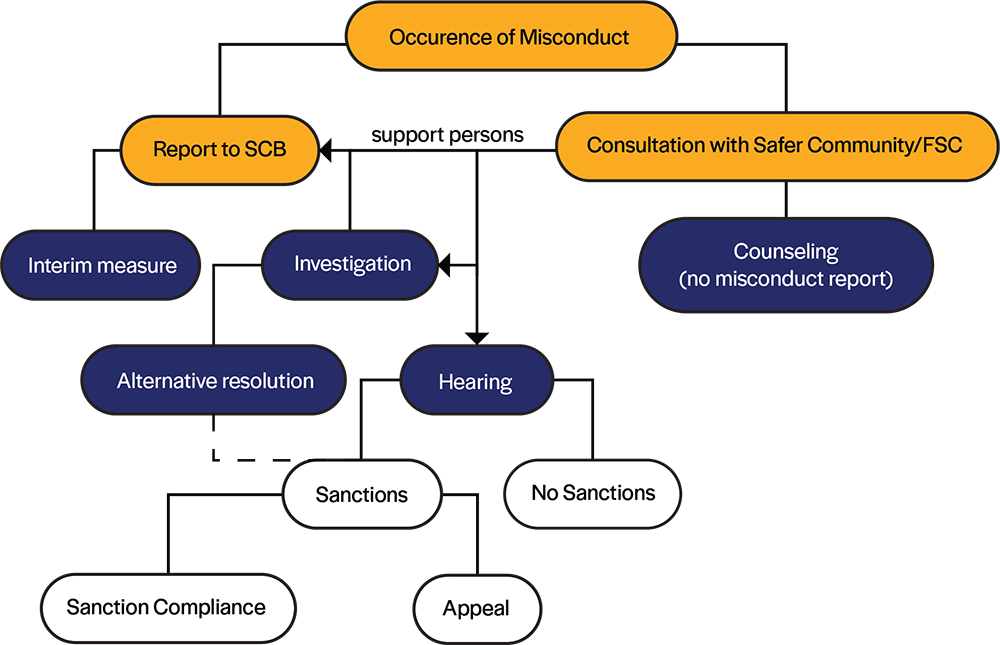

# Procedure

What should you do when you sense the occurrence of misconduct? 
- If it is a small case that occurs for the first time, you should let the person know that you are uncomfortable, and would like that person to stop that behavior. 
- If you feel like it affects you mentally and/or physically, even if it happens for the first time, you should seek for consultation from either Wellness Center or the Student Council, and seek help from the Safer Community to devise a safety plan for you. 
- If it is a small but recurring case, you should ask for consultation from the Wellness Center or the Student Council, and seek help from the Safer Community to devise a safety plan for you. 
- If you think that this is a serious case, you could choose to report directly to the Student Conduct Board. 

